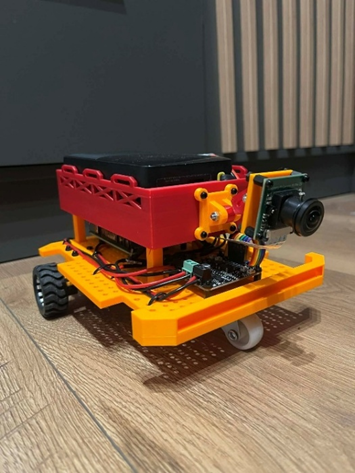
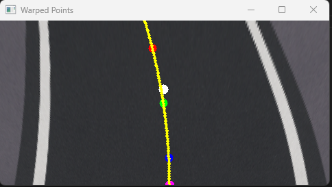

# 🚗 CARLOS  
### Vision-Based Autonomous Mobile Platform  

Real-time lane detection and traffic sign recognition system running on Raspberry Pi 4.

---

## 📌 About the Project

CARLOS (Cognitive Autonomous Road-Learning Operating System) is a small-scale autonomous mobile platform developed as an engineering thesis project.

The system is designed to:

- Follow a marked lane using a monocular camera  
- Detect and classify selected traffic signs  
- Adapt steering in real time using differential drive control  
- Operate autonomously without human intervention  

This repository contains the **complete software stack** running on the robot.

---

## 🖼️ Full Platform Overview

<p align="center">
  
</p>

CARLOS autonomous mobile platform integrating vision system, control logic and differential drive hardware.

---

## 🧠 System Overview

CARLOS integrates:

- Computer Vision (OpenCV-based)
- Real-time control logic
- PWM motor control
- Raspberry Pi hardware interface
- Differential drive kinematics

### High-Level Pipeline
  ```python
  Camera Frame
  ↓
  Lane Detection → Steering Error
  Sign Detection → Event Info
  ↓
  Drive Control (P-controller + fallback)
  ↓
  Motor PWM Output


---

## 🛣 Lane Detection Module

Implemented using classical computer vision techniques (no machine learning):

- BGR → HSV thresholding
- Morphological filtering
- Perspective transform (bird’s-eye view)
- Histogram-based lane localization
- Polynomial fitting
- Lateral & heading error estimation

**Output:**
- Lane center offset
- Lane validity flag
- Steering correction input

Example of real-time lane detection with perspective transform and polynomial fitting:

<p align="center">
  
</p>

The image above shows:
- Bird’s-eye view transformation
- Lane segmentation mask
- Fitted lane polynomial
- Center offset estimation

---

## 🚸 Traffic Sign Detection Module

Multi-stage detection pipeline:

1. Edge detection (Canny)
2. Contour extraction
3. Shape classification (triangle / circle / octagon)
4. HSV dominant color filtering
5. ORB feature matching against internal sign database

**Supported classes:**
- STOP
- Speed limits
- Warning signs
- Mandatory signs

**Output:**
-Classified sign label
-confidence score

Example of traffic sign detection with contour analysis and ORB matching:

<p align="center">
  
</p>

The detection pipeline visualizes:
- Extracted contour
- Bounding box
- Classified sign label
- Confidence score

---

## 🎛 Control Logic

The `Drive_Control` module implements:

- Proportional steering controller
- Differential speed mapping:

  ```python
  left  = base_speed - steering
  right = base_speed + steering

- Steering saturation limits
- Emergency fallback mode when lane detection becomes unreliable

## ⚙️ Hardware Platform

The software runs on a fully integrated autonomous mobile platform consisting of:

- **Raspberry Pi 4 Model B** – main computing unit  
- **CSI 5MP camera with 180° wide-angle lens** – monocular vision system  
- **Dual N20 DC gear motors (75:1)** – differential drive propulsion  
- **Cytron MDD3A motor driver** – dual-channel H-bridge control  
- **Differential drive configuration** – independent left/right wheel control  
- **Separated power architecture** – independent supplies for logic and motors  

The hardware architecture was designed to support real-time vision processing while maintaining stable motor control under embedded constraints.

---

## 🛠 Technologies Used

- **Python**
- **OpenCV**
- **NumPy**
- **GPIO + PWM motor control**
- **Object-Oriented Programming (modular architecture)**
- **Real-time image processing on embedded Linux (Raspberry Pi OS)**

The system avoids machine learning by design and relies entirely on deterministic computer vision and control algorithms.

---

## 🔬 Engineering Challenges Addressed

During development, several real-world engineering challenges were identified and addressed:

- Wide-angle lens distortion affecting contour-based sign detection  
- Sensitivity of HSV segmentation to lighting conditions  
- Real-time processing constraints on Raspberry Pi hardware  
- Steering instability under partial lane loss  
- Separation of perception, decision, and execution layers  
- Power supply noise isolation between motors and logic system  

The project focuses not only on functionality but also on robustness under practical embedded conditions.

---

## 🚀 Current Status

- ✔ Fully integrated hardware + software system  
- ✔ Real-time lane following  
- ✔ Real-time traffic sign recognition  
- ✔ Adaptive steering control  
- ✔ Laboratory validation completed  

### Ongoing Improvements

- Crossroad detection refinement  
- Improved fallback robustness  
- Lens distortion correction  
- Sign-based speed adaptation  
- Performance optimization for higher frame rate stability  

---

## ▶ How to Run

1. Clone the repository:
  ```python
  git clone https://github.com/Tomasz-Marek/Autonomous_car.git
  cd CARLOS


2. Create and activate a virtual environment:
  ```python
  python -m venv .venv
  source .venv/bin/activate # Linux / macOS
  ..venv\Scripts\activate # Windows


3. Install dependencies:
  ```python
  pip install -r requirements.txt

4. Run the main control loop:
  ```python
  python Python_codes/Main.py


Ensure that the Raspberry Pi camera and motor driver are properly connected before execution.

---

## 🎓 Background

Developed as part of an engineering thesis focused on:

> Vision-based autonomous navigation and adaptive control in small-scale mobile platforms.

The project integrates mechanical design, embedded electronics, real-time computer vision, and control theory into a cohesive autonomous system.

---

## 📄 License

MIT License
